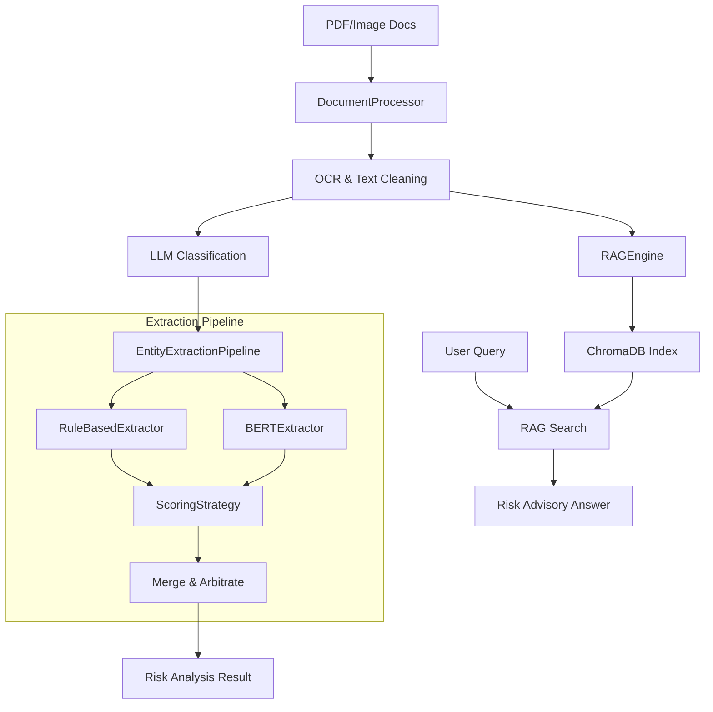

# Finance-Risk-RAG v2.3

<div align="center">

**银行级多语言财务文本风控 AI 系统**

[](https://www.python.org/downloads/)
[](LICENSE)
[]()

OCR 智能识别 · BERT 实体提取 · RAG 风险问答 · Streamlit 可视化面板

</div>

---

## 项目简介

Finance-Risk-RAG 是一套**银行级财务文本风控 AI 系统**，整合 OCR、BERT 实体提取、规则引擎与 RAG 检索增强生成，支持批量 PDF 处理、风险实体识别与智能问答。

> 本仓库为**高级金融风控优化版**，目前已升级至 v2.3。

---

## 系统架构



---

## v2.3 核心能力与架构优化

| 模块 | 说明 |
|------|------|
| **解耦评分引擎** | 引入 `ScoringStrategy` 接口，支持可插拔的风险评分逻辑。 |
| **长文本支持** | `BERTExtractor` 引入滑动窗口 (Sliding Window) 切片，支持任意长度文档。 |
| **标准服务接口** | `RiskAnalysisService` 统一 API 返回格式，增强系统集成稳定性。 |
| **银行级 OCR** | 针对财务报表优化的 Tesseract 配置与图像预处理。 |
| **可视化面板** | 基于 Streamlit 的 v2.3 交互式面板，支持实时风险透视。 |

---

## 快速开始

```bash
git clone https://github.com/eninem123/finance-risk-rag-v2.git
cd finance-risk-rag-v2
pip install -r requirements.txt

# 全流程处理 (OCR + 分类 + 实体提取 + RAG 索引)
python main.py process --input ./docs/

# RAG 风险咨询
python main.py query "分析该公司的流动性风险"

# 生成专业风险报告
python main.py report --input document.pdf --output-dir reports/

# 启动可视化面板
python main.py dashboard
```

---

## 项目结构

```
finance_risk_rag/
├── src/finance_risk_rag/
│   ├── service.py          # 业务编排服务层 (Standardized API)
│   ├── extractor.py        # 实体提取 (BaseExtractor & ScoringStrategy)
│   ├── processor.py        # 文档 OCR 处理与分类
│   ├── engine.py           # RAG 引擎与向量检索
│   ├── models.py           # 数据模型 (Entity, ExtractionResult, etc.)
│   └── config.py           # 中心化配置管理
├── dashboard.py            # Streamlit UI v2.3
├── main.py                 # 统一 CLI 入口
├── tests/                  # 自动化测试套件
└── docs/                   # 示例文档与说明
```

---

## 许可证

MIT License — 详见 [LICENSE](LICENSE)
