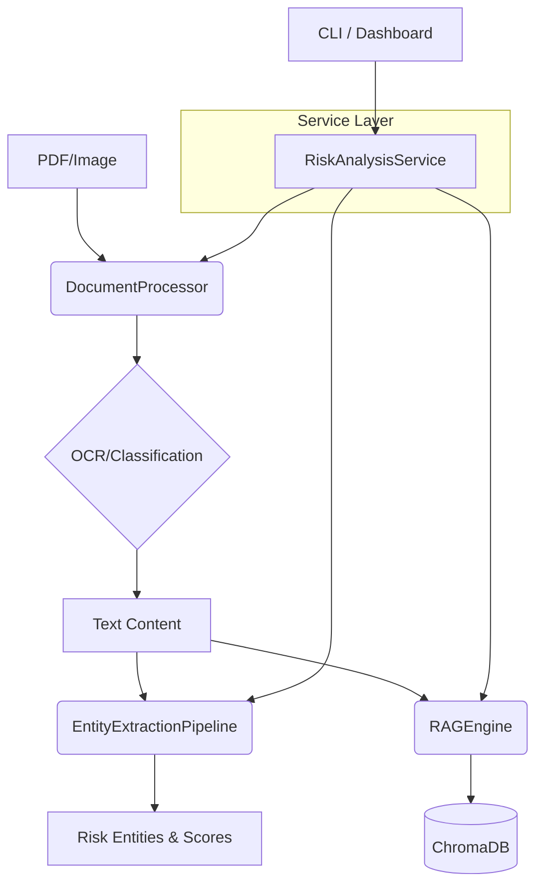

<div align="center">

# 🏦 Finance-Risk-RAG v2.2

**银行级多语言财务文本风控 AI 系统**

**Professional Multi-language Financial Risk AI Control System**

[](https://www.python.org/downloads/)
[](LICENSE)
[](https://github.com/psf/black)
[]()
[]()

**OCR 智能识别 · BERT 实体提取 · 业务服务编排 · Streamlit 交互大盘**

</div>

---

## 🎯 项目简介

Finance-Risk-RAG 是一套**银行级财务文本风控 AI 系统**，专为金融机构的贷前审查、贷后监控和风险预警场景设计。

v2.2 版本引入了全新的 **RiskAnalysisService 业务编排层** 与 **Streamlit 交互式大盘**，显著提升了系统的集成能力与用户体验。

> 🌐 **双语支持**：完整支持中英文财务文档处理，面向国际化场景。

---

## ✨ 核心功能

### 📑 智能 OCR 与文档分类
- 高分辨率图像增强，支持扫描/混合 PDF
- **AI 自动分类**：审计报告、财报、行业报告等
- 批量处理与增量更新

### 🔍 精准风险实体识别
- **17 类** 金融风险实体（债务、纠纷、欺诈等）
- **混合提取引擎**：BERT 深度学习 + 规则引擎
- **坐标级去重**：基于字符偏移量的精准重叠消除

### 🧠 编排化 RAG 问答
- **RiskAnalysisService**：一键完成“解析-提取-索引-分析”全流程
- 基于 ChromaDB 的语义检索，回答精准可溯源
- 支持多轮对话与风险场景咨询

### 📊 可视化监控大盘
- 基于 Streamlit 的交互式 Web 界面
- 风险分布统计与文档深度透视
- 实时对话式风险问答

---

## 🏗️ 系统架构 (v2.2)



---

## 🚀 快速开始

### 安装部署

```bash
# 1. 克隆与进入目录
git clone https://github.com/eninem123/finance-risk-rag-v2.git
cd finance-risk-rag-v2

# 2. 安装依赖
pip install -r requirements.txt

# 3. 运行仪表盘 (推荐)
streamlit run dashboard.py
```

### 命令行使用

```bash
# 全流程分析单个文档并生成报告
python main.py report --input docs/audit_report_2023.pdf

# 批量分析目录
python main.py report --input ./docs/

# 智能风险问答
python main.py query "该公司的负债率是否存在异常？"
```

---

## 📁 项目结构

```
src/finance_risk_rag/
├── service.py        # [New] 业务编排服务
├── processor.py      # OCR 与分类处理
├── extractor.py      # 实体提取 (BERT+Rules)
├── engine.py         # RAG 核心引擎
├── models.py         # 统一数据模型 (含偏移量)
├── config.py         # 系统配置
└── utils.py          # 工具类
dashboard.py          # [New] Streamlit 仪表盘
main.py               # 统一命令行入口
```

---

## 🧪 质量保障

- ✅ **单元测试**：核心模块完整测试覆盖
- ✅ **偏移量算法**：解决实体识别重叠问题
- ✅ **类型检查**：Mypy 静态类型检查
- ✅ **CI 流水线**：GitHub Actions 自动化验证

---

## 📄 许可证

MIT License - 详见 [LICENSE](LICENSE) 文件

---

<div align="center">

**Made with ❤️ for Financial Safety**

</div>
