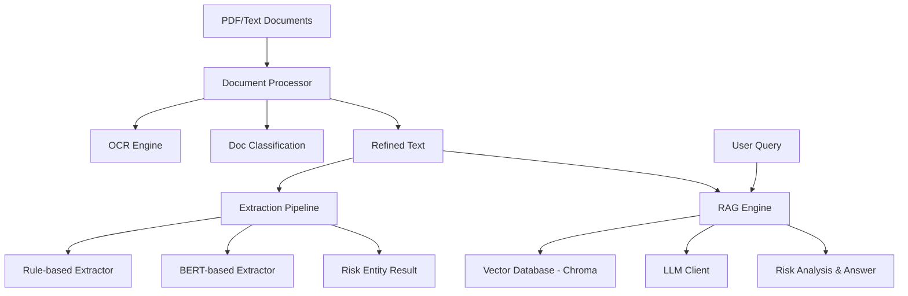

# Finance-Risk-RAG v2.1

<div align="center">

**Enterprise-Grade Multi-language Financial Risk Control RAG System**

[](https://www.python.org/downloads/)
[](LICENSE)
[](https://github.com/psf/black)

</div>

---

## 📋 Table of Contents

- [Overview](#overview)
- [Architecture](#architecture)
- [Project Structure](#project-structure)
- [Quick Start](#quick-start)
- [CLI Usage](#cli-usage)
- [API Reference](#api-reference)
- [Development](#development)

---

## Overview

Finance-Risk-RAG is a specialized Retrieval-Augmented Generation (RAG) system designed for automated financial risk analysis. It processes PDF documents through a high-precision OCR pipeline, classifies them, extracts risk entities using rule-based and BERT-based models, and provides a conversational interface for risk querying.

### Key Capabilities

| Feature | Implementation | Benefit |
|---------|----------------|---------|
| **Advanced OCR** | Tesseract 5.x + Custom Image Optimization | High accuracy even for complex layouts |
| **Document Classification** | LLM-driven Classification | Automatic sorting of industry/audit reports |
| **Risk Entity Extraction** | Rule-based + BERT (NER) | Precise identification of 17+ financial risk types |
| **Intelligent RAG** | ChromaDB + ONNX Embeddings + LLM | Context-aware risk Q&A with source attribution |
| **Unified CLI** | Centralized Command Interface | Streamlined processing, extraction, and querying |

---

## Architecture



---

## Project Structure

```
finance-risk-rag/
├── main.py                 # Unified CLI Entry Point
├── src/
│   └── finance_risk_rag/   # Core Package
│       ├── config.py       # Configuration Management
│       ├── engine.py       # RAG Logic (Indexing/Query)
│       ├── extractor.py    # Risk Entity Extraction
│       ├── llm.py          # Centralized LLM Interface
│       ├── models.py       # Shared Data Classes
│       ├── processor.py    # OCR & Document Processing
│       └── utils.py        # Shared Utilities
├── tests/                  # Unit Test Suite
├── docs/                   # Detailed Documentation
├── knowledge_base/         # Risk Rules & Finance Dictionaries
└── requirements.txt        # Dependency Manifest
```

---

## 🚀 Quick Start

### Installation

```bash
# Clone the repository
git clone https://github.com/eninem123/finance-risk-rag-v2.git
cd finance-risk-rag-v2

# Install dependencies
pip install -r requirements.txt
```

### Configuration

Create a `.env` file or set environment variables:

```env
OPENAI_API_KEY=your_key_here
# Optional: MOONSHOT_API_KEY=your_key_here
LLM_PROVIDER=moonshot
LLM_BASE_URL=https://api.moonshot.cn/v1
TESSERACT_CMD=C:\Program Files\Tesseract-OCR\tesseract.exe
```

---

## 🛠 CLI Usage

### 1. Process Documents (OCR & Classification)
```bash
python main.py process --docs-dir docs/
```

### 2. Extract Risk Entities
```bash
python main.py extract --input docs/all_extracted.txt --output docs/risk_report.json
```

### 3. Query the RAG System
```bash
# Build index and ask a question
python main.py query "What are the liquidity risks mentioned in the reports?" --build
```

---

## 📖 API Reference

See [docs/API.md](docs/API.md) for detailed class and function documentation.

---

## 👩‍💻 Development

See [docs/DEVELOPMENT.md](docs/DEVELOPMENT.md) for setup instructions and coding standards.

---

<div align="center">
Developed by Jules - Senior Financial Software Engineer
</div>
