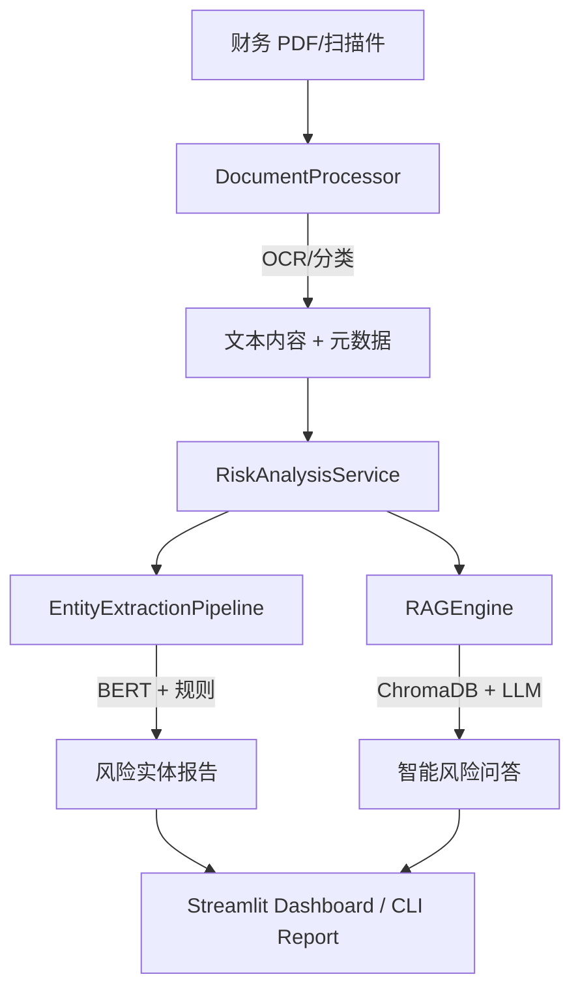

<div align="center">

# 🏦 Finance-Risk-RAG v2.2

**银行级多语言财务文本风控 AI 系统**

**Professional Multi-language Financial Risk AI Control System**

[](https://www.python.org/downloads/)
[](LICENSE)
[](https://github.com/psf/black)
[]()
[]()

**智能编排服务 · 精准偏移量提取 · 企业级风控分析 · 交互式仪表盘**

</div>

---

## 🎯 项目简介

Finance-Risk-RAG 是一套专为金融机构设计的**银行级财务文本风控 AI 系统**。它不仅能处理海量 PDF 财务文档，更能通过深度学习与规则引擎的协同，精准识别潜在的合规、违约及财务欺诈风险。

在 v2.2 版本中，我们引入了全新的 **RiskAnalysisService 编排层**、**精准字符偏移量追踪**以及 **Streamlit 交互式仪表盘**，将系统的专业度与可用性推向了新的高度。

---

## ✨ 核心升级 (v2.2)

- 🏗️ **智能编排架构**：新增 `RiskAnalysisService`，一键串联 OCR、分类、实体提取与 RAG 分析。
- 📍 **精准偏移量追踪**：所有风险实体均带有 `start_char` 和 `end_char` 偏移量，支持原文精准回溯。
- 🧠 **混合提取引擎**：BERT 深度学习模型支持自动分块处理长文本，并与规则引擎进行高精度冲突仲裁。
- 📊 **交互式仪表盘**：全新 Streamlit 界面，支持可视化文档扫描、实体分析与 RAG 智能对话。
- 🛠️ **统一 CLI 2.0**：增强的命令行接口，支持 `report` 子命令生成全流程分析结果。

---

## 🏗️ 系统架构



---

## 🚀 快速开始

### 安装环境
```bash
git clone https://github.com/eninem123/finance-risk-rag-v2.git
cd finance-risk-rag-v2
pip install -r requirements.txt
```

### 启动交互式仪表盘
```bash
streamlit run dashboard.py
```

### 使用命令行生成报告
```bash
# 分析单个文件
python main.py report --input docs/sample.pdf

# 批量分析目录
python main.py report --input ./docs/
```

---

## 📁 目录结构

```
finance-risk-rag-v2/
├── src/
│   └── finance_risk_rag/     # 核心源码包
│       ├── service.py        # [NEW] 编排服务层
│       ├── processor.py      # 文档处理 (OCR/分类)
│       ├── extractor.py      # 实体提取 (BERT/规则)
│       ├── engine.py         # RAG 检索引擎
│       ├── models.py         # 统一数据模型
│       └── config.py         # 集中配置管理
├── dashboard.py              # [NEW] Streamlit 交互界面
├── main.py                   # 统一命令行入口
├── tests/                    # 完善的测试套件
└── knowledge_base/           # 风险词典与规则
```

---

## 🤝 贡献与反馈

欢迎提交 Issue 和 Pull Request。本项目遵循 MIT 许可证。

<div align="center">

**金融 AI 赋能风险管理，让每一份报告都更专业。**

Made with ❤️ by Jules (Senior Finance Developer AI)

</div>
