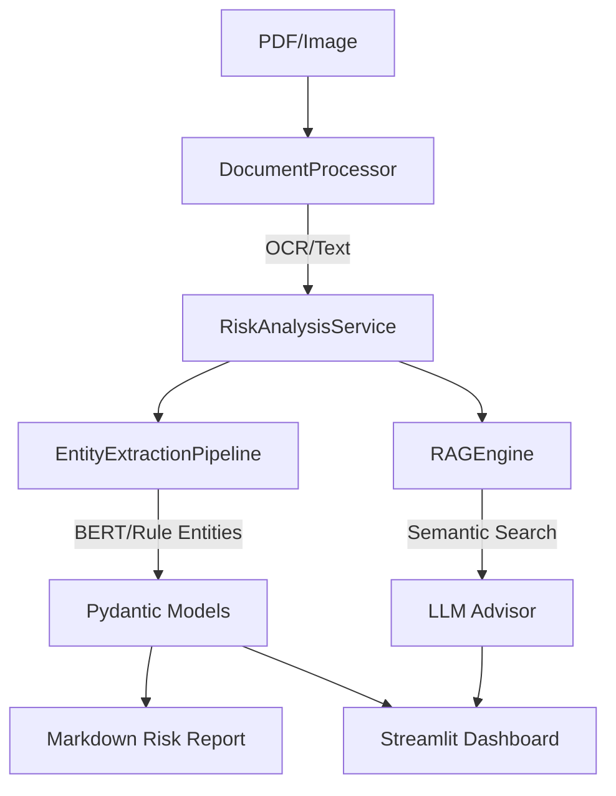

# Finance-Risk-RAG v2.3

<div align="center">

**银行级多语言财务文本风控 AI 系统**

[](https://www.python.org/downloads/)
[](LICENSE)
[]()

OCR 智能识别 · BERT 实体提取 · RAG 风险问答 · Pydantic 数据驱动 · Streamlit 可视化报告

</div>

---

## 项目简介

Finance-Risk-RAG 是一套**专业级财务文本风控 AI 系统**，专为金融审计、尽职调查与合规审查设计。系统整合了先进的 OCR 技术、BERT 命名实体识别、RAG 检索增强生成以及 Pydantic 数据验证框架，提供从原始 PDF 到深度风险报告的全流程自动化处理。

### v2.3 核心升级
- **架构升级**: 全面迁移至 `Pydantic v2` 和 `Pydantic-Settings`，提供更强的类型安全与配置校验。
- **智能摘要**: 引入 LLM 生成的 Executive Summary，自动提取报告核心风险点。
- **专业报告**: 增强型 Markdown 报告生成，包含分级审计建议与风险量化分析。
- **可视化面板**: 全新“风险报告”页面，支持 PDF 在线分析、风险分布可视化及报告一键导出。
- **代码质量**: 全模块 Google-style Docstrings 与 PEP 484 类型标注。

---

## 系统架构



---

## 快速开始

### 1. 环境准备
```bash
git clone https://github.com/eninem123/finance-risk-rag-v2.git
cd finance-risk-rag-v2
pip install -r requirements.txt
```

### 2. 核心功能执行
```bash
# 全流程处理：OCR -> 分类 -> 索引
python main.py process --input ./docs/

# RAG 风险问答
python main.py query "该公司的关联交易存在哪些违约风险？"

# 生成专业风险报告
python main.py report --input sample_audit.pdf --output-dir reports/

# 启动交互式可视化面板
python main.py dashboard
```

---

## 模块说明

| 模块 | 核心职责 |
|------|----------|
| `RiskAnalysisService` | **核心编排层**：协调 OCR、分类、提取与报告生成。 |
| `DocumentProcessor` | **文档解析**：支持多语言 Tesseract OCR、图像增强与文档分类。 |
| `EntityExtractionPipeline` | **风险提取**：BERT 深度提取 + 金融领域规则引擎 + 自动仲裁。 |
| `RAGEngine` | **知识检索**：基于 ChromaDB 的向量存储与上下文感知问答。 |
| `Config` | **配置管理**：基于 Pydantic Settings，支持 `.env` 与环境变量。 |

---

## 项目结构

```
finance-risk-rag-v2/
├── src/finance_risk_rag/
│   ├── service.py          # 业务编排服务层
│   ├── extractor.py        # 风险实体提取管道
│   ├── processor.py        # OCR 与文档预处理
│   ├── engine.py           # RAG 检索引擎
│   ├── models.py           # Pydantic 数据模型
│   ├── config.py           # 系统配置中心
│   └── ...
├── dashboard.py            # Streamlit 企业级看板
├── main.py                 # 统一 CLI 入口
├── tests/                  # 完备的单元测试套件
└── .github/workflows/      # CI/CD 自动化流水线
```

---

## 许可证

MIT License — 详见 [LICENSE](LICENSE)
