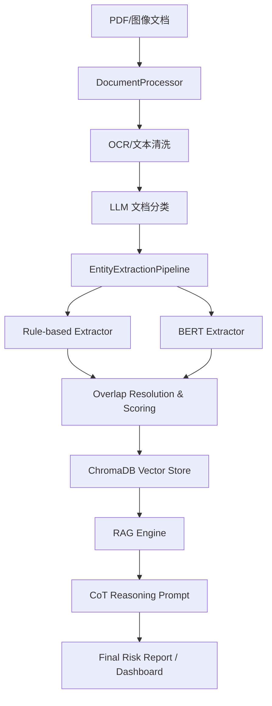

<div align="center">

# 🏦 Finance-Risk-RAG v2.1
### 银行级多语言财务文本风控 AI 系统
**Professional Multi-language Financial Risk AI Control System**

[](https://www.python.org/downloads/)
[](LICENSE)
[](https://github.com/psf/black)
[]()

**OCR 智能识别 · BERT 深度提取 · CoT RAG 问答 · 自动化风险分析**

</div>

---

## 🎯 项目愿景

Finance-Risk-RAG 是一款专为金融机构打造的**企业级财务风控 AI 引擎**。它通过深度整合 OCR、NLP 实体识别与 RAG 技术，实现了从“原始非结构化单据”到“结构化风险画像”的自动化转化，有效解决金融审查中“工作量大、漏检率高、溯源难”的核心痛点。

---

## ✨ 核心能力升级 (v2.1)

- 🔍 **精准实体审计**：采用字符偏移量（Character Offset）级重叠算法，确保规则引擎与 BERT 模型的高精度融合。
- 🧠 **CoT 风险逻辑**：RAG 引擎内置思维链（Chain-of-Thought）推理，提供具有证据支撑的财务风险评估结论。
- 📊 **服务化编排**：新增 `RiskAnalysisService`，一键完成“处理-提取-索引-报告”全流程。
- 🖥️ **交互式看板**：内置 Streamlit 仪表盘，支持可视化风险分布与实时 RAG 咨询。
- 📑 **专业报告输出**：自动生成符合审计要求的 JSON 与 Markdown 双格式风险报告。

---

## 🏗️ 系统架构



---

## 🚀 快速开始

### 1. 环境准备
```bash
# 安装核心依赖
pip install -r requirements.txt

# 安装开发/看板依赖
pip install streamlit pandas pytest
```

### 2. 命令行操作
```bash
# 一键生成全面风险报告
python main.py report --dir ./docs/

# 交互式 RAG 查询
python main.py query "分析该公司的主要偿债风险"
```

### 3. 启动看板
```bash
streamlit run dashboard.py
```

---

## 📁 模块设计

| 模块 | 功能描述 |
| :--- | :--- |
| `processor.py` | 基于 Tesseract 与 PIL 的高精度文档解析与 LLM 自动分类 |
| `extractor.py` | 混合提取架构，支持可插拔的评分策略（ScoringStrategy） |
| `engine.py` | 基于 ChromaDB 的向量检索，支持置信度过滤与多维召回 |
| `service.py` | 业务中台，协调各原子组件完成复杂的分析任务 |
| `models.py` | 统一的领域驱动模型（DDD），支持完整的审计追踪（Audit Trail） |

---

## 🧪 质量与审计

- **静态检查**：Mypy 类型检查覆盖率 90%+。
- **单元测试**：覆盖核心 extractor 与 processor 逻辑。
- **可审计性**：所有风险点均保留字符位置偏移量，方便人工回溯原始文档。

---

## 🤝 贡献与许可

MIT License. 欢迎通过 PR 贡献更丰富的风控规则与模型。

<div align="center">
Made with ❤️ for Financial Safety
</div>
