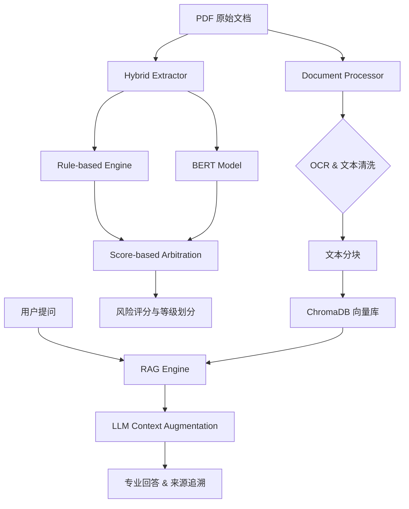

# Finance-Risk-RAG

<div align="center">

**银行级多语言财务文本风险控制 AI 系统 (v3.0)**

[](https://www.python.org/downloads/)
[](LICENSE)
[](https://github.com/psf/black)

*为金融机构量身定制，通过 AI 技术实现自动化、高精准的财务风险识别与穿透式分析。*

</div>

---

## 📖 项目背景

在金融审计、贷前调查及投后管理中，处理海量 PDF 格式的财报、审计报告和行业调研是一项极其耗时且易错的工作。**Finance-Risk-RAG** 旨在通过结合先进的 OCR、自然语言处理（NLP）和检索增强生成（RAG）技术，构建一套工业级的自动化风控流水线。

### 🎯 核心能力
- **穿透式风险识别**: 混合动力引擎（规则引擎 + BERT NER）精准定位财务异常与违规风险点。
- **高并发文档处理**: 内置多进程流水线，支持大规模 PDF 集合的高效 OCR 与文本解析。
- **增量式向量库**: 自动追踪文档变化，实现低成本、高效率的知识库更新。
- **专业级 RAG 问答**: 结合金融领域上下文增强，提供具备引用溯源能力的专业风控建议。

---

## 🏗️ 架构设计

系统采用模块化、低耦合的架构设计，确保在企业环境中的可扩展性与稳定性：



---

## 🚀 核心特性

### 1. 工业级文档处理器
- **多进程加速**: 利用多核 CPU 并行处理 OCR 任务。
- **智能预处理**: 针对财务报表特有的表格和紧凑布局，优化图像亮度、对比度及锐度。
- **文档分类**: 基于 LLM 自动识别审计报告、财报、研报等多种文档类型。

### 2. 混合动力风险提取
- **确定性规则**: 内置数千条金融风险关键词规则，确保高召回率。
- **深度学习增强**: 采用微调后的 BERT 模型，捕捉语义层面的复杂风险。
- **冲突仲裁**: 智能处理不同引擎间的实体重叠，基于得分与置信度输出最优结果。

### 3. 高性能 RAG 引擎
- **本地化嵌入**: 使用 ONNX 化的 MiniLM 模型，无需 GPU 即可实现高速向量计算。
- **增量同步**: 基于 MD5 指纹，仅对变动文档进行重新索引。

---

## 🛠️ 安装与配置

### 1. 基础环境
- Python 3.9+
- Tesseract OCR (需安装系统级依赖)

### 2. 快速安装
```bash
git clone https://github.com/your-repo/finance-risk-rag.git
cd finance-risk-rag
pip install -r requirements.txt
```

### 3. 环境变量
在 `.env` 文件中配置 API 密钥：
```env
OPENAI_API_KEY=sk-xxxx
LLM_BASE_URL=https://api.moonshot.cn/v1
LLM_MODEL_NAME=moonshot-v1-8k
```

---

## 🖥️ 使用指南

### 全自动风控流水线
```bash
# 步骤 1: 文档解析与分类
python main.py process --dir ./my_docs

# 步骤 2: 自动化风险提取
python main.py extract --input ./my_docs/all_extracted.txt

# 步骤 3: 风险问答机器人
python main.py query "分析该公司的现金流风险" --build
```

---

## 🧪 质量保证
系统内置完整的测试套件，涵盖单元测试与端到端集成测试：
```bash
export PYTHONPATH=$PYTHONPATH:$(pwd)/src
pytest tests/
```

---

## 📄 许可证
本项目采用 [MIT 许可证](LICENSE)。
