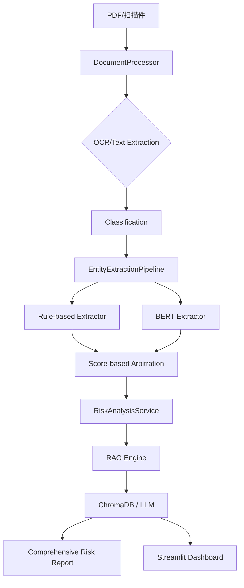

<div align="center">

# 🏦 Finance-Risk-RAG v2.2

**企业级多语言财务文本风控 AI 系统**

**Professional Multi-language Financial Risk AI Control System**

[](https://www.python.org/downloads/)
[](LICENSE)
[](https://github.com/psf/black)
[]()
[]()

**OCR 智能识别 · BERT 实体提取 · RAG 风险问答 · 自动化风险报告 · Streamlit 看板**

</div>

---

## 🎯 项目简介

Finance-Risk-RAG 是一套**企业级财务文本风控 AI 系统**，专为金融机构的贷前审查、贷后监控和风险预警场景设计。

系统整合了 **OCR 智能识别**、**BERT 实体提取**、**规则引擎匹配**与 **RAG 检索增强生成** 四大核心能力，能够批量处理 PDF 财务文档，自动识别风险实体并提供智能问答与深度风险报告。

> 🌐 **双语支持**：完整支持中英文财务文档处理，面向国际化金融场景。

---

## ✨ 核心功能

### 📑 智能 OCR 与文档分类
- 高分辨率图像增强算法，提升扫描件识别率。
- 自动文档分类（审计报告、财报、研报等）与版面分析。
- 支持目录级递归扫描与增量处理（文件 Hash 校验）。

### 🔍 多维风险实体识别 (Hybrid Extraction)
- **17 类**金融风险实体精准识别。
- **混合引擎**：BERT 深度学习模型 + 规则引擎双重校验。
- **冲突仲裁**：基于字符偏移量与置信度的实体去重与合并。
- **评分策略**：可插拔的风险评分策略，量化文档风险。

### 🧠 RAG 智能风险分析
- 基于 ChromaDB 的语义检索。
- **自动化报告**：一键生成 Markdown/JSON 格式的深度风险分析报告。
- **智能问答**：精准、可溯源的风险咨询问答，支持上下文理解。

### 📊 可视化看板
- 基于 Streamlit 的交互式 Dashboard。
- 文档状态监控、风险实体可视化分布、在线 RAG 对话。

---

## 🏗️ 系统架构



---

## 🚀 快速开始

### 安装部署

```bash
# 1. 克隆项目
git clone https://github.com/eninem123/finance-risk-rag-v2.git
cd finance-risk-rag-v2

# 2. 安装依赖
pip install -r requirements.txt

# 3. 环境变量设置
cp .env.example .env
# 编辑 .env 文件，填写 LLM API Key (Moonshot/OpenAI)
```

### 命令行使用 (CLI)

```bash
# 1. 生成综合风险报告 (OCR + 实体提取 + AI 分析)
python main.py report --input ./docs/sample.pdf --output ./reports/

# 2. 批量处理目录
python main.py report --input ./docs/ --output ./reports/

# 3. 启动 RAG 问答 (交互式)
python main.py query "该公司的负债率是否存在重大风险？" --build
```

### 启动可视化看板

```bash
streamlit run dashboard.py
```

---

## 📁 项目结构

```
finance-risk-rag-v2/
├── src/
│   └── finance_risk_rag/     # 核心源码包
│       ├── service.py        # 核心编排服务 (New!)
│       ├── engine.py         # RAG 检索与 LLM 引擎
│       ├── extractor.py      # 混合实体提取器
│       ├── processor.py      # 文档处理与 OCR 优化
│       ├── models.py         # 统一数据模型
│       └── ...
├── dashboard.py              # Streamlit 看板 (New!)
├── main.py                   # 统一命令行入口
├── reports/                  # 生成的风险报告 (Markdown/JSON)
├── tests/                    # 单元测试套件
└── README.md
```

---

## 🛠️ 技术栈

- **NLP**: Transformers (BERT), Sentence-Transformers
- **Vector DB**: ChromaDB
- **OCR**: Tesseract OCR + Pillow Image Enhancement
- **Web**: Streamlit
- **LLM**: Moonshot AI / OpenAI API
- **QA**: Black, Mypy, Flake8, Pytest

---

## 🤝 贡献指南

欢迎提交 Issue 和 Pull Request！

1. Fork 本仓库
2. 创建特性分支 (`git checkout -b feature/AmazingFeature`)
3. 提交更改 (`git commit -m 'Add some AmazingFeature'`)
4. 推送到分支 (`git push origin feature/AmazingFeature`)
5. 创建 Pull Request

---

<div align="center">

**如果这个项目对你有帮助，别忘了点个 ⭐ Star 支持一下**

</div>
