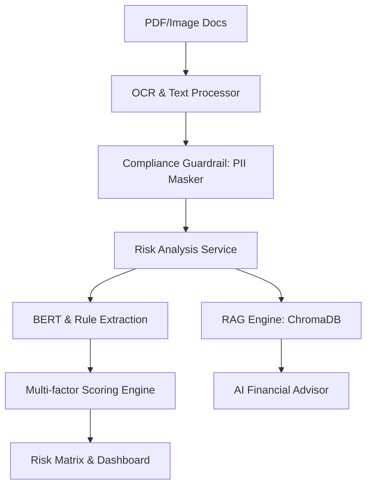

# Finance-Risk-RAG v2.3

<div align="center">

**企业级多语言财务文本风控 AI 系统**

[](https://www.python.org/downloads/)
[](LICENSE)
[]()
[](https://docs.pydantic.dev/)

异步管道 · PII 数据脱敏 · 风险矩阵分析 · 银行级风控编排

</div>

---

## 🏛️ 系统使命：风险治理 (Risk Governance)

Finance-Risk-RAG 致力于为金融机构提供一套**透明、可审计、高可靠**的财务文本风险治理方案。通过整合先进的 NLP 提取能力与 RAG 检索技术，我们在保障数据隐私（PII 脱敏）的前提下，实现对海量财务报表的智能化合规审查与风险量化。

---

## 🚀 核心架构



---

## 🌟 系统能力 (System Capabilities)

### 1. 金融级风险量化 (Quantified Risk Scoring)
- **多维度评分策略**: 结合 BERT 置信度、关键词权重（逾期、违约、资不抵债等）及上下文关联进行动态调分。
- **风险分类映射**: 自动将风险点归类为信用风险、财务风险、机构风险、法律合规风险等。

### 2. 生产环境可用性 (Production Ready)
- **异步并行处理**: LLM 客户端全面支持 `asyncio`，大幅提升批量处理性能。
- **配置健壮性**: 基于 `Pydantic Settings` 的配置系统，支持 `.env` 自动化加载。
- **PII 安全脱敏**: 自动识别并屏蔽银行账号、身份证号、邮箱等敏感信息，确保 LLM 交互合规。

### 3. 专业可视化面板 (Advanced Dashboard)
- **风险分布矩阵**: 通过 Plotly 呈现 影响程度 vs 发生概率 的四象限视图。
- **智能风险问答**: 结合本地知识库的 RAG 系统，提供具备事实支撑的风险分析。

---

## 🛠️ 开发者指南

我们提供了 `Makefile` 以简化日常开发流程：

```bash
# 安装生产与开发依赖
make install

# 启动专业可视化面板
make dashboard

# 运行自动化测试套件
make test

# 执行代码风格检查
make lint
```

---

## 📊 快速启动 CLI

```bash
# 全流程处理 PDF
python main.py process --input ./docs/

# 生成企业级风险报告
python main.py report --input sample.pdf --output-dir reports/

# 智能风险检索 (支持异步)
python main.py query "该公司的流动性风险如何？"
```

---

## ⚖️ 许可证

本项目基于 MIT 许可证开源。所有功能旨在辅助金融风险分析，不作为法律或财务决策的唯一依据。
